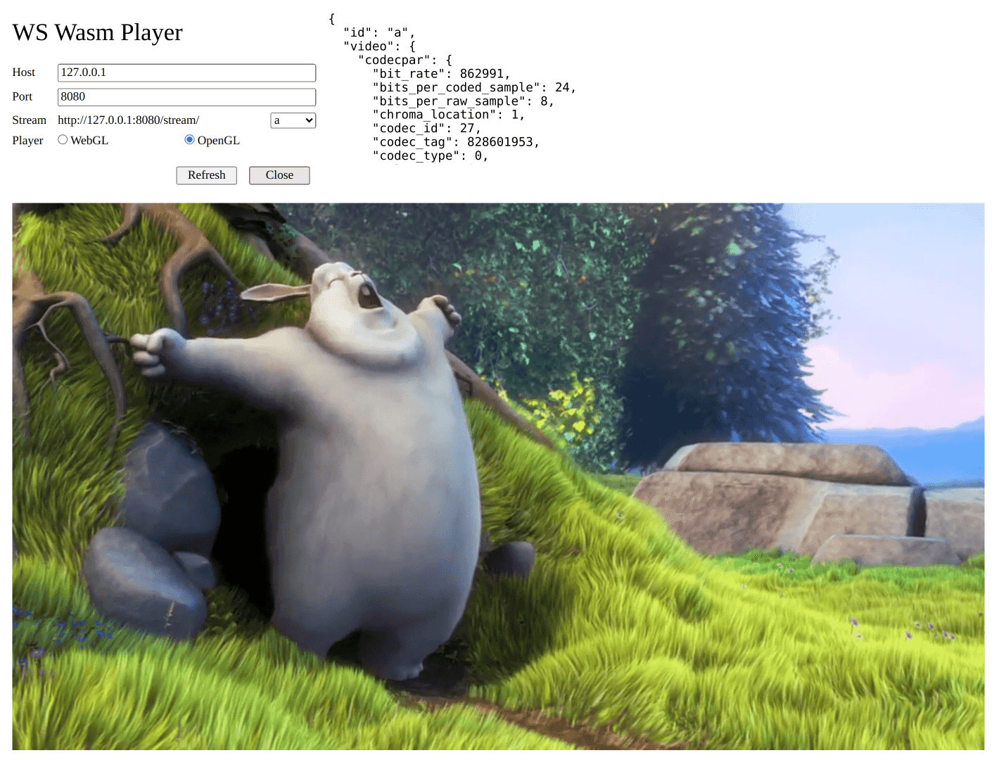

# RTSP Wasm Player

## Overview

```txt
# RTSP WebSocket Proxy
RTSP/Webcam/File > FFmpeg open > Packets > WebSocket

# WS Wasm Player
WebSocket > Packets > Wasm FFmpeg decode to YUV > WebGL display
                                                > Wasm OpenGL display

# WS Local Player
WebSocket > Packets > FFmpeg decode to YUV > OpenGL display

# RTSP Local Player
RTSP/Webcam/File > FFmpeg open and decode to BGR/YUV > OpenCV/OpenGL display
```



## Usage

### Prerequisites

- Ubuntu 18.04

#### Install develop tools

```bash
sudo apt install -y build-essential git wget yasm

# cmake: https://cmake.org/download/
export PATH=./cmake-3.21.1-linux-x86_64/bin:$PATH
```

#### Prepare third-party dependencies

- [Boost.Beast](https://github.com/boostorg/beast): HTTP for stream infos (CORS supported), WebSocket for stream packets.
- [FFmpeg](https://ffmpeg.org/): RTSP/Webcam/File open, decode (h264/hevc/rawvideo), scale and bsf (bitstream filter) for annexb format.
- [glog](https://github.com/google/glog): logging. It can also enable macro `UTIL_LOGGER_ENABLE` to use `stdout` instead.
- [glfw](https://www.glfw.org/), [glew](http://glew.sourceforge.net/), [glm](https://github.com/g-truc/glm): OpenGL render, yuv420p to rgb888.
- [jbeder/yaml-cpp](https://github.com/jbeder/yaml-cpp): read/write config file.
- [nlohmann/json](https://github.com/nlohmann/json): parse/stringify http json.

```bash
git clone https://github.com/ikuokuo/rtsp-wasm-player.git
cd rtsp-wasm-player
export MY_ROOT=`pwd`

# boost: https://www.boost.org/
#  Beast: https://github.com/boostorg/beast
wget -p $MY_ROOT/3rdparty/ https://boostorg.jfrog.io/artifactory/main/release/1.76.0/source/boost_1_76_0.tar.bz2
cd $MY_ROOT/3rdparty/
tar --bzip2 -xf boost_1_76_0.tar.bz2
cd $MY_ROOT/3rdparty/boost_1_76_0/
./bootstrap.sh --prefix=$MY_ROOT/3rdparty/boost-1.76 --with-libraries=coroutine
./b2 install
cd $MY_ROOT/3rdparty/
ln -s boost-1.76 $MY_ROOT/3rdparty/boost

# ffmpeg: https://ffmpeg.org/
git clone --depth 1 -b n4.4 https://git.ffmpeg.org/ffmpeg.git $MY_ROOT/3rdparty/source/ffmpeg
cd $MY_ROOT/3rdparty/source/ffmpeg
./configure --prefix=$MY_ROOT/3rdparty/ffmpeg-4.4 \
--enable-gpl --enable-version3 \
--disable-programs --disable-doc --disable-everything \
--enable-decoder=h264 --enable-parser=h264 \
--enable-decoder=hevc --enable-parser=hevc \
--enable-hwaccel=h264_nvdec --enable-hwaccel=hevc_nvdec \
--enable-demuxer=rtsp \
--enable-demuxer=rawvideo --enable-decoder=rawvideo --enable-indev=v4l2 \
--enable-protocol=file \
--enable-bsf=h264_mp4toannexb --enable-bsf=hevc_mp4toannexb --enable-bsf=null
make -j`nproc`
make install
cd $MY_ROOT/3rdparty/
ln -s ffmpeg-4.4 $MY_ROOT/3rdparty/ffmpeg

# glog: https://github.com/google/glog
git clone --depth 1 -b v0.5.0 https://github.com/google/glog.git $MY_ROOT/3rdparty/source/glog
cd $MY_ROOT/3rdparty/source/glog
mkdir _build; cd _build
cmake -DCMAKE_INSTALL_PREFIX=$MY_ROOT/3rdparty/glog-0.5 ..
cmake --build . --target install --config Release -- -j`nproc`
cd $MY_ROOT/3rdparty/
ln -s glog-0.5 $MY_ROOT/3rdparty/glog

# glew, glfw3
sudo apt install -y libglew-dev libglfw3-dev
# glm
git clone --depth 1 -b 0.9.9.8 https://github.com/g-truc/glm.git $MY_ROOT/3rdparty/glm

# jbeder/yaml-cpp: https://github.com/jbeder/yaml-cpp
git clone --depth 1 -b yaml-cpp-0.7.0 https://github.com/jbeder/yaml-cpp.git $MY_ROOT/3rdparty/source/yaml-cpp
cd $MY_ROOT/3rdparty/source/yaml-cpp
mkdir _build; cd _build
cmake -DCMAKE_INSTALL_PREFIX=$MY_ROOT/3rdparty/yaml-cpp-0.7.0 -DYAML_CPP_BUILD_TESTS=OFF ..
cmake --build . --target install --config Release -- -j`nproc`
cd $MY_ROOT/3rdparty/
ln -s yaml-cpp-0.7.0 $MY_ROOT/3rdparty/yaml-cpp

# nlohmann/json: https://github.com/nlohmann/json
git clone --depth 1 -b v3.10.0 https://github.com/nlohmann/json.git $MY_ROOT/3rdparty/json
```

#### Rebuild `wasm` libraries

If wanna rebuild `wasm` libraries in `ws-wasm-player`, install [Emscripten](https://emscripten.org/) first:

```bash
# Get the emsdk repo
git clone --depth 1 https://github.com/emscripten-core/emsdk.git
# Enter that directory
cd emsdk
# Fetch the latest version of the emsdk (not needed the first time you clone)
git pull
# Download and install the latest SDK tools.
./emsdk install latest
# Make the "latest" SDK "active" for the current user. (writes .emscripten file)
./emsdk activate latest
# Activate PATH and other environment variables in the current terminal
source ./emsdk_env.sh
```

Then:

```bash
cd rtsp-wasm-player
export MY_ROOT=`pwd`

cd $MY_ROOT/3rdparty/source/ffmpeg
emconfigure ./configure --prefix=$MY_ROOT/ws-wasm-player/dist/ffmpeg \
--cc=emcc --cxx=em++ --ar=emar --ranlib=emranlib --disable-stripping \
--enable-cross-compile --target-os=none --arch=x86_32 --cpu=generic \
--disable-x86asm --disable-inline-asm \
--enable-gpl --enable-version3 \
--disable-programs --disable-doc --disable-everything \
--enable-decoder=h264 --enable-parser=h264 \
--enable-decoder=hevc --enable-parser=hevc \
--enable-decoder=rawvideo \
--enable-bsf=h264_mp4toannexb --enable-bsf=hevc_mp4toannexb --enable-bsf=null
emmake make -j`nproc`
emmake make install

# emcc settings
#  https://emscripten.org/docs/tools_reference/emcc.html
#  https://github.com/emscripten-core/emscripten/blob/main/src/settings.js
cd $MY_ROOT/ws-wasm-player
emcc -std=c++14 -Os -DNDEBUG -s WASM=1 -s USE_SDL=2 -v \
-I . -I .. -I dist/ffmpeg/include \
-I ../3rdparty/boost/include \
-I ../3rdparty/json/single_include \
-I ../3rdparty/glm \
-L dist/ffmpeg/lib \
-lavcodec -lavdevice -lavfilter -lavformat \
-lavutil -lpostproc -lswresample -lswscale \
-D UTIL_LOG_TAG=\"WASM\" \
-D UTIL_LOGGER_ENABLE \
src/main.cc ../common/media/*.cc \
--bind -o lib/decoder.js

# emcc debugging
#  https://emscripten.org/docs/debugging/Sanitizers.html
emcc -std=c++14 -g2 -s WASM=1 -s USE_SDL=2 -v \
-fsanitize=address -s ALLOW_MEMORY_GROWTH=1 \
...
```

<!--
wasm-ld: error: unknown file type: *.o
  make clean
sws_getContext, Fatal: error in validating wasm2js output
  WASM=1

emcc -std=c++14 -Os -DNDEBUG -s WASM=0 -s USE_SDL=2 \
-s MODULARIZE=1 -s EXPORT_NAME=\"'ModuleGL'\" \
-->

### Build

```bash
cd rtsp-wasm-player
# build all projects in rootdir
make
# clean in rootdir
make clean
# clean all, include subdirs
make cleanall
```

#### RTSP WebSocket Proxy

```txt
RTSP/Webcam/File > FFmpeg open > Packets > WebSocket
```

Build and run:

```bash
cd rtsp-ws-proxy

# build
make

# run
./_output/bin/rtsp-ws-proxy ./config.yaml
```

#### WS Wasm Player

```txt
WebSocket > Packets > Wasm FFmpeg decode to YUV > WebGL display
                                                > Wasm OpenGL display
```

Run:

```bash
cd ws-wasm-player
python -m http.server 8000
# open http://127.0.0.1:8000 in browser
#   or http://127.0.0.1:8080 (served by rtsp-ws-proxy by default)
```

#### WS Local Player

```txt
WebSocket > Packets > FFmpeg decode to YUV > OpenGL display
```

Build and run:

```bash
cd ws-local-player

# build
make

# run
./_output/bin/ws-local-player ./config.yaml [stream_id]
```

#### RTSP Local Player

```txt
RTSP/Webcam/File > FFmpeg open and decode to BGR/YUV > OpenCV/OpenGL display
```

Build and run:

```bash
cd rtsp-local-player

# if wanna enable build with opencv
# export OpenCV_DIR=~/opencv-4/lib/cmake/opencv4

# build
make

# run
./_output/bin/rtsp-local-player_ogl ./cfg_rtsp.yaml
#  or
./_output/bin/rtsp-local-player_ocv ./cfg_webcam.yaml
```
